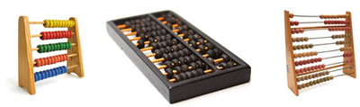

# História da Computação

A história da computação é repleta de avanços incríveis e inovações que moldaram o mundo da tecnologia como o conhecemos hoje. Neste capítulo, exploraremos marcos significativos na evolução da computação.

## Ábaco: O Início

O ábaco é frequentemente considerado o primeiro dispositivo de cálculo. Desenvolvido há milhares de anos, o ábaco era uma ferramenta manual utilizada para realizar cálculos simples. Embora primitivo em comparação com os computadores modernos, o ábaco foi uma inovação importante na história da computação.

## Máquina Analítica de Charles Babbage

No século XIX, Charles Babbage projetou a Máquina Analítica, considerada o primeiro projeto de um computador geral. Embora nunca tenha sido construída em sua totalidade durante sua vida, os princípios de funcionamento da Máquina Analítica influenciaram fortemente o desenvolvimento posterior de computadores.

## Primeiros Computadores Eletrônicos

Durante a Segunda Guerra Mundial, os primeiros computadores eletrônicos, como o ENIAC, foram construídos para fins militares. Essas máquinas enormes foram pioneiras na computação eletrônica e tiveram um papel crucial na pesquisa científica e militar.

## Era Moderna dos Computadores

O final do século XX e o início do século XXI testemunharam um rápido avanço na tecnologia de computadores. Os computadores pessoais, a Internet e a computação em nuvem revolucionaram a forma como trabalhamos, nos comunicamos e processamos informações.

Neste curso, exploraremos esses e outros marcos na história da computação, dando-lhe uma compreensão abrangente das origens e evolução da tecnologia que usamos todos os dias.

Continue explorando os outros tópicos para obter uma visão mais aprofundada sobre computação.

- [Princípios Básicos de Hardware e Software](principios-hardware-software.md)
- [Modelos de Dados](modelos-dados.md)
