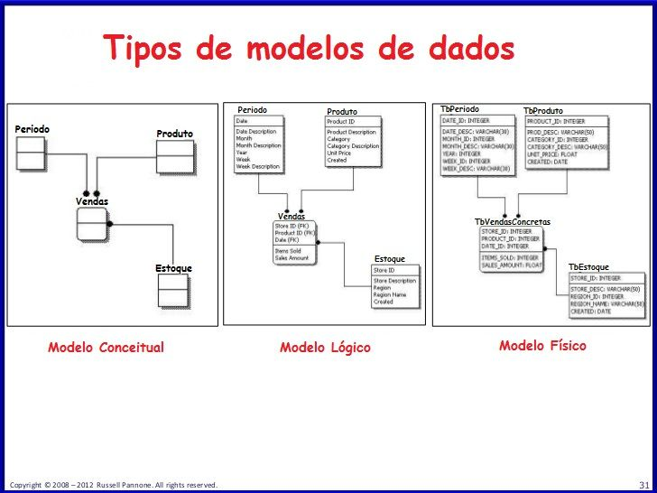
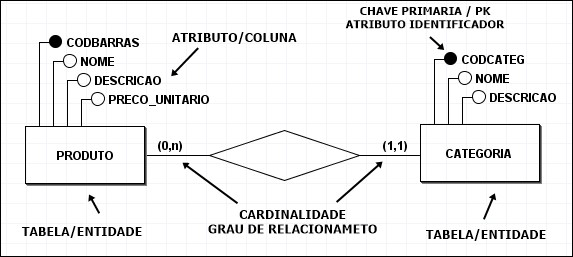
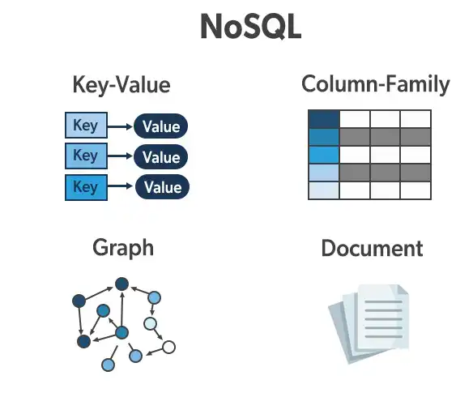
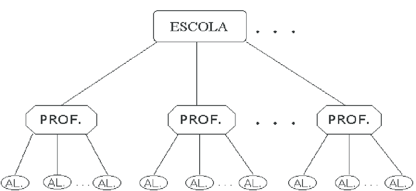
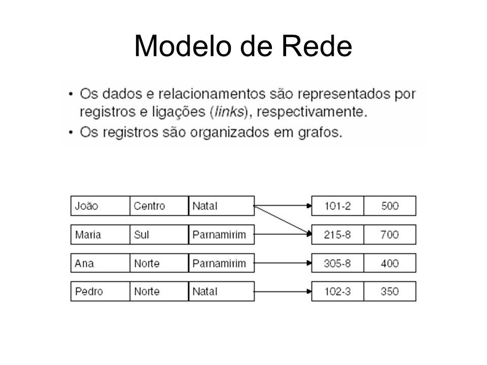

# Modelos de Dados

Neste capítulo, exploraremos os diferentes modelos de dados usados na computação e na organização de informações.

## Modelo de Dados Relacional

O modelo de dados relacional é um dos modelos mais amplamente usados em bancos de dados. Ele organiza os dados em tabelas com linhas e colunas, e usa chaves primárias e estrangeiras para estabelecer relacionamentos entre as tabelas. É amplamente utilizado em sistemas de gerenciamento de bancos de dados relacionais (RDBMS), como MySQL, PostgreSQL e Oracle.

## Modelo de Dados NoSQL

Os bancos de dados NoSQL (não relacionais) adotam abordagens diferentes para armazenar dados, permitindo maior flexibilidade na estrutura dos dados. Esses modelos incluem bancos de dados de documentos, de chave-valor, de colunas amplas e de grafos. Eles são adequados para cenários em que os dados são variados e não se encaixam bem em um esquema de tabela relacional.

## Modelo de Dados Hierárquico

O modelo de dados hierárquico organiza os dados em uma estrutura de árvore, na qual os registros são conectados hierarquicamente. Este modelo é comumente usado em sistemas de gerenciamento de bancos de dados hierárquicos e é adequado para representar relações pai-filho.

## Modelo de Dados em Rede

O modelo de dados em rede é semelhante ao hierárquico, mas permite relações mais complexas entre os registros. Ele é frequentemente usado em sistemas de gerenciamento de bancos de dados em rede e é útil para representar relações muitos-para-muitos.

# Mapa Mental: Modelos de Dados

## 1. Modelo Hierárquico

- **Definição:**
  - Representa dados em uma estrutura de árvore.
  - Níveis de hierarquia definem a relação entre os dados.

- **Exemplo do Mundo Real:**
  - Sistema escolar:
    - Departamento
      - Curso
        - Disciplina

## 2. Modelo de Rede

- **Definição:**
  - Usa grafos para representar dados.
  - Registros podem ter múltiplas conexões.

- **Exemplo do Mundo Real:**
  - Rede social:
    - Usuários interconectados.

## 3. Modelo Relacional

- **Definição:**
  - Organiza dados em tabelas.
  - Relacionamentos são estabelecidos por chaves.

- **Exemplo do Mundo Real:**
  - Banco de dados de biblioteca:
    - Tabelas para Livros, Autores, Empréstimos.

## 4. Modelo de Objetos

- **Definição:**
  - Representa dados como objetos.
  - Relações entre objetos refletem relações do mundo real.

- **Exemplo do Mundo Real:**
  - Jogo online:
    - Personagens e Itens como objetos.

## 5. Modelo Orientado a Documentos

- **Definição:**
  - Armazena dados em documentos (JSON, XML).
  - Flexível e escalável.

- **Exemplo do Mundo Real:**
  - Catálogo de produtos online:
    - Documentos detalhando cada produto.

## Escolhendo o Modelo de Dados Adequado

A escolha do modelo de dados apropriado depende das necessidades específicas do seu sistema e dos tipos de dados que você deseja armazenar. Cada modelo tem suas vantagens e desvantagens, e a escolha certa pode fazer a diferença no desempenho e na eficiência do seu sistema.

Neste curso, você explorará em detalhes os diferentes modelos de dados, suas características e casos de uso, para que possa tomar decisões informadas ao projetar sistemas de armazenamento de dados.

Continue explorando os outros tópicos para aprofundar seu conhecimento sobre computação.

- [História da Computação](historia-computacao.md)
- [Princípios Básicos de Hardware e Software](principios-hardware-software.md)
