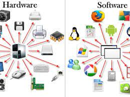

# Princípios Básicos de Hardware e Software

Neste capítulo, exploraremos os princípios básicos que sustentam o funcionamento dos sistemas de computação, incluindo hardware e software.

## Hardware

O hardware refere-se a todos os componentes físicos de um computador. Isso inclui:

- Processador (CPU)
- Memória RAM
- Disco rígido (ou unidade de estado sólido)
- Placa-mãe
- Placa de vídeo
- Monitor
- Teclado
- Mouse
- E outros periféricos

O hardware é a parte tangível de um sistema de computação e desempenha um papel fundamental na execução de tarefas de processamento de dados.

## Software

O software consiste em programas de computador, sistemas operacionais e aplicativos que permitem ao hardware executar tarefas específicas. O software é a parte lógica de um sistema de computação e inclui:

- Sistemas operacionais (por exemplo, Windows, macOS, Linux)
- Aplicativos de produtividade (por exemplo, processadores de texto, planilhas)
- Software de entretenimento (jogos)
- Aplicativos da web
- E muito mais

O software e o hardware trabalham juntos para permitir que os computadores executem uma ampla variedade de tarefas, desde processamento de texto até execução de aplicativos complexos.

## Interconexão entre Hardware e Software

A interação entre hardware e software é fundamental para o funcionamento de um computador. O software instrui o hardware sobre como executar tarefas específicas, e o hardware fornece os recursos físicos necessários para executar essas tarefas. Essa cooperação é o que torna os computadores tão versáteis.

Neste curso, você aprenderá mais sobre os princípios subjacentes ao hardware e software, bem como como eles se relacionam para criar sistemas de computação funcionais.

Continue explorando os outros tópicos para aprofundar seu conhecimento sobre computação.

- [História da Computação](historia-computacao.md)
- [Modelos de Dados](modelos-dados.md)
